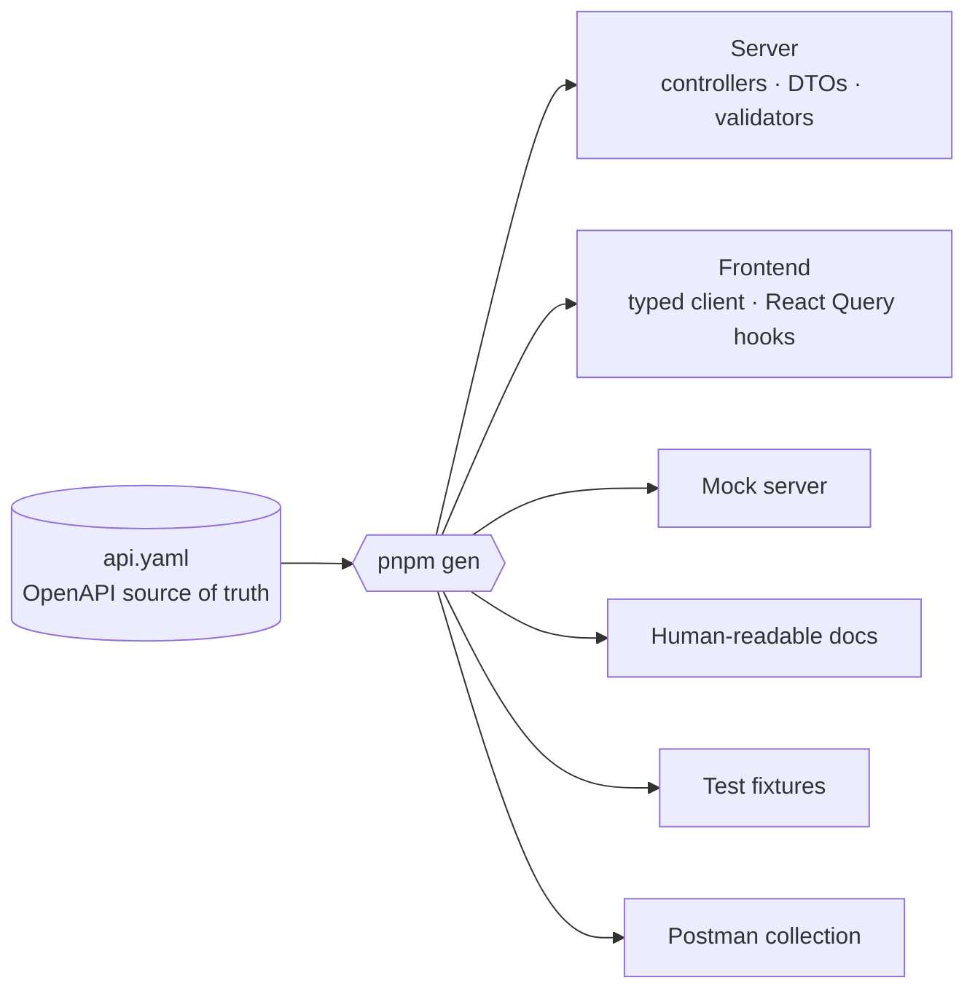
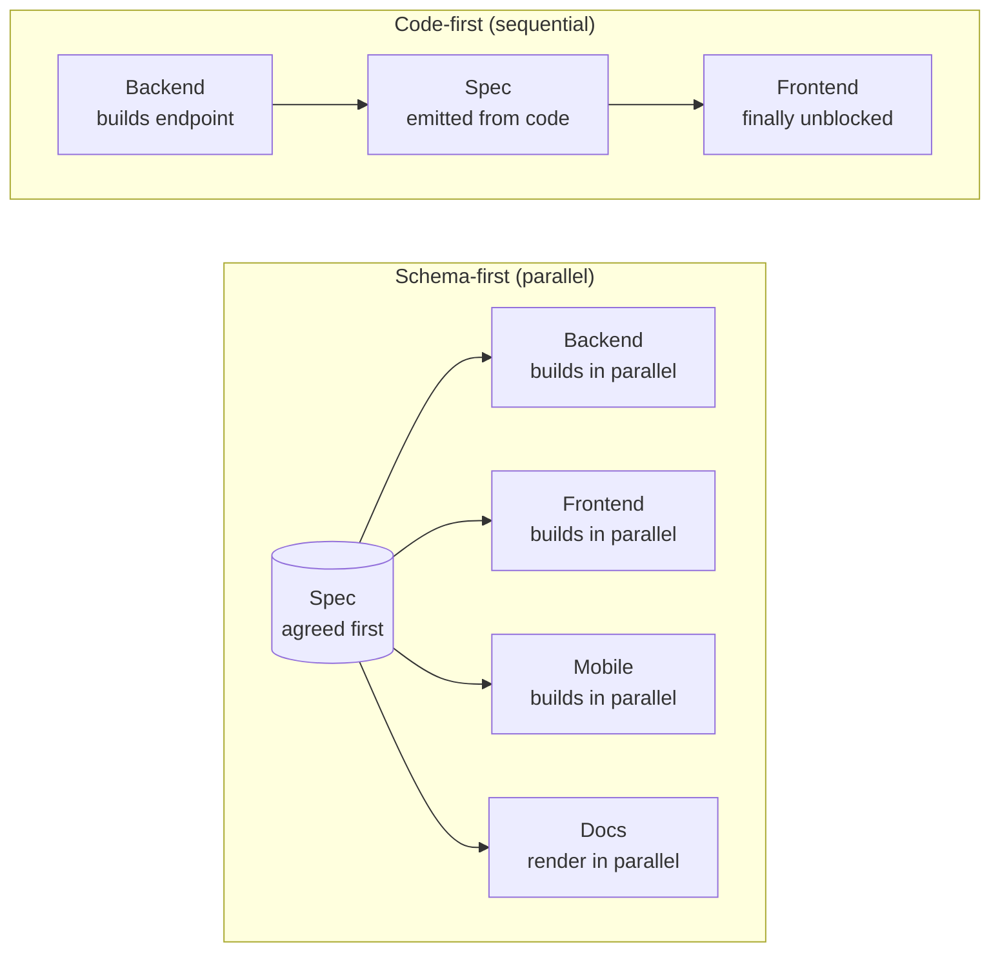

Most API changes are small. Small API changes can still ruin afternoons.

Add a required field, rename a query param, split one endpoint into two. The change itself is minutes. The hunt for every consumer can take hours, and the consumer that bites you is always the one you forgot. The other team's app. The reporting service that fires once a week. The webhook worker nobody owns anymore.

The pain isn't the change. The pain is the mental load of worrying about every place that also needs to change.

I've been working schema-first for a while now and that pain is mostly gone. I still make API changes. I just don't have to go hunting for the consequences. The compiler tells me where they are.

## What schema-first actually means

Schema-first is the practice of writing your API contract before you write any code that depends on it. For HTTP APIs that means OpenAPI. For event-driven systems it means AsyncAPI. You define endpoints, request and response shapes, headers, query params, status codes, error formats, the lot, in a YAML or JSON document. Once the team agrees on it, that document is committed and treated as the source of truth.

Then, and only then, the code arrives. Server stubs, request validators, client SDKs, frontend hooks, mock servers, docs: all of them generated from the spec. The only hand-written code is the business logic and the integrations. Everything else is derivable.

It's a small reordering of the workflow with disproportionate downstream effects.

Quick disclaimer. There are other approaches to this same/similar family of problems. gRPC defines the contract in Protocol Buffers and gives you generated clients in basically every language, with the operational cost of HTTP/2 everywhere and a sometimes tricky browser story. tRPC skips the explicit spec and gives you end-to-end TypeScript types directly, at the cost of needing TypeScript on both ends and no good story for non-TS consumers. GraphQL replaces the REST surface with a different shape, which solves a real problem (backends need to quickly support whatever their frontend teams want to do) at the cost of a sometimes significant complexity budget.

Each of those has good use cases and I'm not here to dunk on any of them, they all have their time and place, but for most of what I build, boring old REST plus OpenAPI is the cleanest tradeoff. The tooling is the most mature, the standard is the most widely understood, and the schema-first benefits I want to talk about apply to it most clearly. The rest of this post assumes that combination, plus AsyncAPI for events/async stuff. Most of what follows transfers to gRPC and friends without much fuss, but I'm going to focus on what I'm most familiar with.

## The spec is many small files

Most people who've encountered OpenAPI did so by opening a stranger's bundled spec — one of those sprawling many-thousand-line YAML files — and concluded that schema-first must be miserable to work with. It isn't. Reading someone else's bundled spec is miserable; writing your own isn't, because you don't write it as one giant file.

Modern OpenAPI tooling supports a folder-and-file convention where each operation, each schema and each shared response lives in its own small file. The [Redocly CLI](https://redocly.com/docs/cli/) is what I reach for, but several other tools handle the same multi-file plus bundle workflow. The structure mirrors the source code modules it describes:

<Figure caption="What an OpenAPI spec actually looks like in your repo. Each operation, schema and shared response is its own small file. The Redocly CLI bundles them into the single YAML the code generators consume.">

```text
spec/api/
├── openapi.yaml                # entry point with $refs into the tree below
├── paths/
│   └── notes/
│       ├── post.yaml           # POST /notes
│       └── [noteId]/
│           ├── get.yaml        # GET /notes/{noteId}
│           └── delete.yaml     # DELETE /notes/{noteId}
└── components/
    ├── schemas/
    │   └── notes/
    │       └── Note.yaml
    └── responses/
        └── BadRequest.yaml
```

</Figure>

Each file is small. One operation, one schema, one response — the same granularity as the source code modules they describe. PR diffs are scoped to the part that changed. Reviews stay focused. Editor navigation works the way it does for any other codebase.

A `redocly bundle` produces the single big YAML the code generators consume. Humans read small files. Machines read the bundle.

## How I got here

I didn't start out thinking about contracts. When I first learned to build APIs I was hand-writing endpoints, hand-typing the matching request and response shapes on the client, and discovering the inevitable mismatch when something didn't work in the browser. Every backend change kicked off a hunt across the frontend. I treated this as part of the job because I didn't know there was anything else.

By the time I was working on Rokkup, that part of the job was a huge part of the job. Three NestJS backends, three React clients, a shared set of interfaces between them, and a long list of bespoke ones. Any non-trivial API change became a half-day of finding, retyping, and hoping I hadn't missed anything. The shape of the system was sometimes bigger than my head and thinking about any change caused a noticeable amount of anxiety.

After some reading of the NestJS docs, the obvious next move was code-first generation. I wired up `@nestjs/swagger` to emit an OpenAPI spec from my decorators and DTOs, then generated a Redux Toolkit Query client off the back of it after fixing an upstream bug. It was better. The frontend types stopped drifting. But the cost was visible in the very verbose controllers. Every endpoint was wrapped in OpenAPI decorators describing its own shape, and because each service generated its own spec from its own code, the cross-service consistency problem was unchanged. I'd reduced the frontend pain at the cost of making the backend uglier.

<Figure caption="One endpoint with @nestjs/swagger. The Api* decorators describe the spec the controller will emit, every DTO field carries an @ApiProperty (not shown), and every other endpoint in the controller pays the same tax.">

```typescript
@ApiTags('Notes')
@Controller('notes')
export class NotesController {
  constructor(private readonly notesService: NotesService) {}

  @Post()
  @HttpCode(HttpStatus.CREATED)
  @ApiOperation({ operationId: 'createNote' })
  @ApiBody({ type: CreateNoteRequestDto })
  @ApiCreatedResponse({ type: NoteDto })
  @ApiBadRequestResponse({ description: 'Validation failed' })
  @ApiUnauthorizedResponse({ description: 'Not signed in' })
  async createNote(@Body() body: CreateNoteRequestDto): Promise<NoteDto> {
    return this.notesService.createNote(body);
  }

  // ...same annotation overhead on every other endpoint
}
```

</Figure>

So I went the other way and started experimenting with schema-first development. The early experiments worked, but the NestJS tooling didn't really exist, and the generators that did exist didn't really do what I wanted. I put the NestJS codegen on the backburner and focussed on Express.js generation which was slightly more mature and looked potentially viable.

The thing that convinced me code generation was actually viable was joining an agency that had built their own internal code generation tool. They used it on production client work and the developers were pretty happy with it, which is rare for internal tooling. Once I was onboarded the benefits were obvious from the first day. I spent the next several years building Express.js apps with that tool, and I never wanted to go back to writing API boilerplate code by hand.

The catch was that it was Express.js. NestJS is my preferred backend and after long enough on Express I wanted it back. When I started on MatterHive I took a small NestJS-from-OpenAPI demo that one of the agency engineers had put together, extended it, and ended up with my own bespoke generator that produced NestJS controllers and DTOs, React Query hooks for client components, a fetch-based API client for server components, and eventually pub/sub consumers from AsyncAPI documents. The tooling is bespoke and limited but it was enough to build MatterHive on, and MatterHive is the project that cemented the opinion this whole post is built on. With the right tooling around it, schema-first is genuinely a great way to build software both fast and well.

I'll talk about that tooling in a later post. The rest of this one is about why the approach itself is worth the upfront cost, regardless of which generator you reach for.

## It forces the design conversation early

The first benefit is the one nobody wants to talk about because it sounds boring: schema-first forces you to design the API before you build it.

If you're going to write an OpenAPI document, you have to know what the resources are, what operations exist on them, what's required and what's optional, how errors are shaped, how pagination works, what auth model you're using, how versioning is handled. You have to make those decisions in YAML, before any code exists.

You were going to make those decisions either way. The question is whether you do that deep thinking and make those decisions at the start, or several weeks into implementation when one of those choices turns out to be wrong and you're refactoring multiple services.

Specs are cheap to change. Code is not. Doing the design work in a place where it's cheap is just good economics.

## Boilerplate disappears

Once a spec exists, anything that's mechanically derivable from it should be machine-generated.

That's a long list. Server routes, service stubs, request bodies, query params, path params, DTOs and validators, response types, header handlers, auth middleware, client SDKs in any language you care about, React Query hooks, mock servers for local development, Postman collections, human-readable docs, even test fixtures. It's a long list of boring boilerplate code that developers no longer need to worry about.

Take the same `POST /notes` endpoint from the previous section. The source-of-truth lives in a single OpenAPI fragment:

<Figure caption="The same endpoint as the source of truth. References ($ref) keep schema definitions in one place and reusable across endpoints, so if you change the Note shape it propagates everywhere it's referenced.">

```yaml
# api/notes.yaml
paths:
  /notes:
    post:
      operationId: createNote
      tags: [Notes]
      requestBody:
        required: true
        content:
          application/json:
            schema: { $ref: '#/components/schemas/CreateNoteRequest' }
      responses:
        '201':
          description: Created
          content:
            application/json:
              schema: { $ref: '#/components/schemas/Note' }
        '400':
          description: Validation failed
        '401':
          description: Not signed in

components:
  schemas:
    CreateNoteRequest:
      type: object
      required: [text]
      properties:
        text:
          type: string
          minLength: 1
    Note:
      type: object
      required: [id, text, createdAt]
      properties:
        id: { type: string, format: uuid }
        text: { type: string }
        createdAt: { type: string, format: date-time }
```

</Figure>

A `pnpm gen` produces the matching DTOs from the schema. They're plain `class-validator` classes that mirror the spec exactly, with no NestJS coupling:

<Figure caption="A generated DTO. Plain class-validator decorators reflecting the schema, with the source banner the codegen writes on every file so it never gets edited by hand.">

```typescript
/* eslint-disable */
// This file is generated by @repo/codegen — do not edit manually.
// Source: spec/openapi/api/bundled.yaml

import { IsNotEmpty, IsString } from 'class-validator';

export class CreateNoteRequest {
  @IsString()
  @IsNotEmpty()
  text!: string;
}
```

</Figure>

The controller is a normal NestJS controller that looks the same as if it were hand-written. It imports the DTOs and gets on with the routing. No abstract base classes or extension hierarchy like some other code generators produce, no spec-describing decorator soup from earlier:

<Figure caption="A NestJS controller that looks hand-written, importing the generated DTOs. Idiomatic NestJS, no @nestjs/swagger annotations, no abstract base to extend. The codegen can scaffold this file or update it via AST when endpoints change, but at the boundary it's yours.">

```typescript
import { CreateNoteRequest, Note } from '@gen/dto/notes';
import { NotesService } from '@/modules/notes/notes.service';
import { Body, Controller, HttpCode, HttpStatus, Post, SerializeOptions } from '@nestjs/common';

@Controller('notes')
export class NotesController {
  constructor(private readonly notesService: NotesService) {}

  @Post()
  @HttpCode(HttpStatus.CREATED)
  @SerializeOptions({ type: Note })
  async createNote(@Body() body: CreateNoteRequest) {
    return this.notesService.createNote(body);
  }
}
```

</Figure>

You implement the method body with your own service. Everything else regenerates from the spec, every time. And "everything else" really is everything: the same spec fans out into the controllers above, the typed client and React Query hooks on the frontend, mock servers, fixtures, and the human-readable reference docs we'll get to in a moment.

<Figure caption="What `pnpm gen` fans out from a single OpenAPI document. The spec is the source of truth; everything below the codegen step is mechanical output that regenerates whenever the spec changes.">



</Figure>

This is the part of the day people complain about. Typing the same shape three times in three places. Updating a validator after changing a model. Keeping a frontend type in sync with a backend type or updating docs by hand. None of that is engineering work. It's clerical work that we were doing because we didn't have a contract to derive it from.

When you do have that contract, your engineers spend their time on the things that actually need a human being: the business logic, the architecture, the user-facing concerns. Everything else is one `pnpm gen` away.

## Changes stop being scary

External user-facing APIs where versioning and breaking changes are scary are still scary. They're still helped by having clear specs you _know_ you're honouring, but the real win is internal: for product APIs with clients that you control, changes become trivially easy.

Adding a required `tenantId` to a POST body, in the world where the spec is the source of truth, is a four-step operation:

1. Update the spec.
2. Run codegen across every consumer.
3. Read the type errors.
4. Fix them.

There's no deep thinking or searching through the codebase. There's no "did I get every app?". There's no half-done deploy where the backend wants `tenantId` but a forgotten worker is still sending the old shape. The diff is the change list. The type checker is the regression test.

This works at any scale but it scales especially well. The cost of an API change in the code-first world goes up roughly linearly with the number of consumers. In the schema-first world it stays roughly flat. One spec change, N codegen runs, N typecheck failures, N fixes. The fix surface is the same, but the discovery is free.

## Teams stop blocking each other

Once the spec is agreed, the integration point is the spec. Everyone can build against it in parallel.

The backend team builds the implementation against generated server stubs. The frontend team builds against a generated client and a mock server, knowing the shape they're coding against will match the eventual real API. The platform team wires up the gateway, the auth, the observability. The mobile team starts on their own client. None of them needs anyone else to finish.

<Figure caption="Code-first builds in series: the frontend can't start until the backend has shipped enough of the implementation to expose a working spec. Schema-first agrees the spec first and lets every team build against it in parallel.">



</Figure>

Compare this to code-first, where the frontend team is structurally blocked until the backend is far enough along to expose a working spec, and even then they're chasing a moving target. Or worse, they hand-write types based on the docs and discover the shape is different the day they integrate.

Schema-first turns the API from a sequential dependency into a published contract. Everyone consumes the contract. The merge at the end works because all the parties were honouring the same document the whole time.

## Consistency comes for free

Specs are a linter's favourite kind of file.

Lint rules I run on every API project: every endpoint has a tag, every error response conforms to a single error model, every list response has the same pagination shape, every required field has a description, naming is consistent across resources. [Spectral](https://stoplight.io/open-source/spectral) is the heavyweight option and great for big teams handling complex schemas. The [Redocly CLI](https://redocly.com/docs/cli/) is what I actually reach for: it organises and bundles multi-file OpenAPI specs, has a built-in linter with a configurable style guide, and renders human-readable docs from the same source. Either one will sit in CI and refuse to merge a spec that drifts from the house style.

This is much trickier in the code-first world. By the time you've spotted that one team uses `created_at` and another uses `createdAt`, both are deployed and both are public. Now you have a migration on your hands. The spec-as-source-of-truth model lets you catch this before any code is written.

I don't have to argue with reviewers about whether an endpoint follows our conventions. The lint rule does it for me.

## Docs you can trust

Documentation is the thing developers always say they'll keep up to date and never do. Six months into any manually coded API project the hand-written docs are wrong. By month twelve the integrators have learned to check the source code instead.

Schema-first kills this by construction. The docs are the spec, rendered. They cannot drift from the implementation because the implementation is generated from the same document. Consumers know the reference site they're reading is correct. "Update the docs" stops being a PR comment. Reviewers stop checking whether the docs still match the code. And you, the person writing the API, write zero standalone API reference docs. You'll still write the getting-started guide and the prose around how to use your service, but the endpoint reference, the part that's expensive to keep accurate, regenerates for free. Endpoint summaries, parameter descriptions, schema notes and example responses all live in the spec already, just rendered for human eyeballs.

<PostImage
  src="/blog/schema-first-development/redocly-demo.png"
  width="1440"
  height="900"
  alt="Redocly CLI rendering an example OpenAPI document into an interactive three-column reference site. The left sidebar lists endpoints grouped by tag. The middle column shows query parameters and response codes for the 'Get museum hours' endpoint. The right column shows a JSON response sample."
  caption="The Redocly CLI rendering an example OpenAPI spec into a three-column interactive site. Sidebar, endpoint detail, and a real response sample, all from the same spec the controllers and DTOs are generated from."
/>

## Less to hold in your head

A side effect of all the above: schema-first development dramatically reduces the cognitive load of working with a system that has many consumers.

In the old workflow, my mental model of any non-trivial API was a graph. This endpoint is consumed by this frontend, this mobile app, this worker, this webhook. To make a safe change I had to traverse the graph in my head. The bigger the graph, the more chance I miss a node.

In the schema-first workflow the graph still exists but I don't have to remember it. The spec is the single thing I think about when designing the change. The codegen fans the change out. The type checker tells me when I miss something. My head is free to think about the actual problem.

It's slightly odd language to use when talking about code but I'm going to say it anyway. Working in a spec-first codebase is just much cosier than working in a manually written or code-first codebase. Much like how a well-crafted test suite makes it relaxed and freeing to make changes to a system, safe in the knowledge that your tests will catch any issues, working in a schema-first codebase is equally liberating.

## The added bonus in this modern age: AI agents thrive on contracts

I added this section last because it isn't the reason I do schema-first development. The developer ergonomics and experience I mentioned in the previous sections were true before LLMs were even a twinkle in Sam Altman's eye and remain true today, but with the increasing adoption of AI-assisted development those same benefits matter even more. Everything that helps a human developer applies just as strongly to an agent, and often more strongly.

Let's imagine what happens when you ask an AI agent to add a required field to a POST body in an artisanally crafted API project.

The agent finds the controller, updates the type, and probably updates the validator. It might find the most-used frontend client and update that. Then it confidently says it has completed the work. You start up your frontend and backend and test it out but find a bug. It then fixes that bug, but you find another and tell it to 'make no mistakes'. Then it gets stuck in a loop. It runs greps, opens files at random, and tries to find every consumer. It finds most of them. It misses some. The diff looks plausible, the build sometimes passes, and you don't find out about the worker that still sends the old shape until production.

Here's what happens in a schema-first project.

The agent edits the spec. It runs the codegen. It runs the typechecker. The typechecker tells it what's broken. It fixes the broken things. The diff is the change list, the same way it would be for me.

The interesting part is why this works. LLMs are pattern matchers operating against a context window. They are good at making local changes that are consistent with their immediate surroundings. They are bad at holding a whole system in their 'head', because their head is the context window and the system is bigger than the window. Schema-first replaces "hold the whole system in your head" with "hold the spec in your head, and let the type checker do the rest". That's a much better fit for how these models actually work and the tokens saved by the spec-first tooling are worth the spec-first adoption alone.

The same tooling that makes humans productive makes agents productive. Good developer ergonomics and good agent ergonomics are usually the same thing. If you want a less frustrating experience using AI on real codebases, give it contracts to work against.

## Tradeoffs

I'm not going to pretend this is free.

The upfront cost is real. Designing a spec might take hours you would otherwise spend writing code. For a throwaway prototype or a script that nobody else will ever consume, it's probably overkill. For anything that more than one person will work on, or anything that will outlive the quarter, the maths works out.

Tooling maturity varies wildly. The TypeScript and Java client stories are excellent. Rust is OK. The existing NestJS server-side story is, frankly, weak. The official [typescript-nestjs-server](https://openapi-generator.tech/docs/generators/typescript-nestjs-server/) generator is still beta and has been for a while and implements an 'ugly' pattern. The community generators each have gaps. This is one of the reasons I'm building my own, which is the subject of a follow-up post.

Generators don't always handle your specific use cases. Some come with plugin systems that make custom functionality easy to bolt on, some don't. Either way, before committing to a generator do some digging: make sure the shapes you actually care about are supported, and budget time for custom plugins or templates if they aren't. Most of the time when you hit the limits of a generator it's because you're doing something off the recommended path. That's often fine, but it's a cost you need to account for.

Spec changes need careful review. Everything else derives from the spec, so a "lgtm" pass isn't a good enough review. The team needs to engage with each spec change properly: the design itself, not just the diff. That's a small extra cost in collaborative effort, more than paid back by how much easier the implementations and the business logic become to review afterwards, but a cost nonetheless. It's a slightly different way of working which might take some getting used to, but it's worth it in my opinion. Lint as much as you can to keep the boring consistency stuff off reviewers' plates and free up time and mental effort for the actual design decisions that still need human engagement.

None of these tradeoffs are deal breakers. They're just the bits I'd want to know before I started.

## What next

This is the first piece in a short series.

Next, I'll get specific about NestJS. The state of OpenAPI server generation for NestJS is the main thing that's been bothering me, so I've been building my own generator with all the lessons learned from my previous experiments. That post will cover the existing options, why I'm building a new one, and what falls out of using a code generator that truly embraces the NestJS-specific surface and fully complies with the specification standards.

After that I'll cover AsyncAPI for type-safe pub/sub queues in NestJS, AsyncAPI for WebSocket gateways, and using [Hey API](https://heyapi.dev/) to generate the frontend clients (React Query hooks, RSC fetchers, the lot).

If you've never tried schema-first on a real project, the practical advice from this piece is: pick a small new endpoint, write the OpenAPI document for it, and run a code generator at it. Half a day of friction, then you'll see the loop. The rest follows.

## Don't just take my word for it

I've been thinking about this for many years now, and the conversation has picked up noticeably in the last couple. Some of that's the tooling getting better. Some of that's AI-assisted development making the benefits hard to ignore. Either way, this isn't a new idea, and there are a lot of people thinking about this topic whose takes are also worth reading.

- Atlassian: [Using spec-first API development for speed and sanity](https://www.atlassian.com/blog/technology/spec-first-api-development). The case for the same workflow at large-engineering-team scale.
- Stoplight: [API-first, API design-first, or code-first: which should you choose](https://blog.stoplight.io/api-first-api-design-first-or-code-first-which-should-you-choose). A clean breakdown of the three workflows, written by people who clearly have a horse in the race but the comparison is still worth checking out.
- AUTO1: [The OpenAPI journey](https://auto1.tech/openapi-journey/). An engineering team's experience adopting OpenAPI design-first across a polyglot microservice fleet, with a useful aside on extending the generators when the defaults don't fit.
- LeanIX: [Ship features faster by introducing an OpenAPI code generator](https://engineering.leanix.net/blog/openapi-code-generation/). They've gone for a slightly convoluted approach with only client generation (I assume they weren't happy with the state of API generators when they came up with this approach) but most of the benefits they describe apply whether you codegen the API or not.
